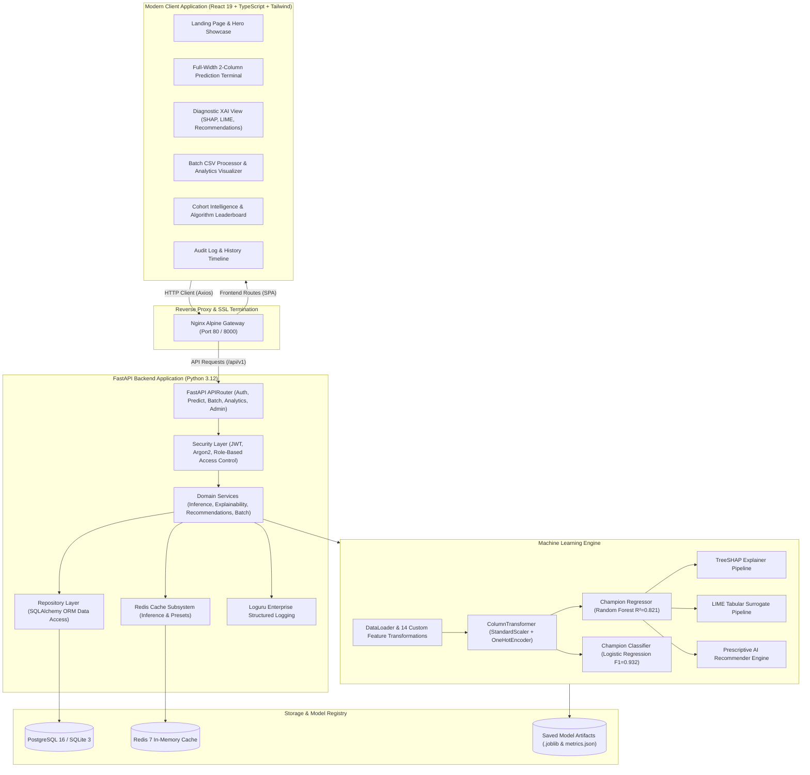

<div align="center">

# 🎓 Student Performance Prediction AI
### *Enterprise-Grade Academic Forecasting, Risk Profiling & Explainable AI SaaS*

[](https://github.com/anishabobade26/student-performance-prediction)
[](LICENSE)

<br/>

[](https://python.org)
[](https://fastapi.tiangolo.com)
[](https://react.dev)
[](https://www.typescriptlang.org)
[](https://tailwindcss.com)
[](https://scikit-learn.org)
[](https://xgboost.readthedocs.io)
[](https://lightgbm.readthedocs.io)
[](https://shap.readthedocs.io)
[](https://docker.com)
[](https://www.postgresql.org)
[](https://redis.io)
[](https://pytest.org)

<br/>

<p align="center">
  <b>A state-of-the-art machine learning web application that forecasts student academic trajectories, calculates dropout/failure risk tiers, demystifies predictions with dual Explainable AI (TreeSHAP & LIME), and formulates tailored learning interventions.</b>
</p>

[🏛️ Architecture](#-system-architecture) • [🏆 Model Benchmarks](#-machine-learning-benchmark-leaderboard) • [🔍 Explainable AI](#-dual-engine-explainable-ai-xai) • [⚡ Quickstart](#-quickstart-guide) • [📡 API Docs](#-rest-api-endpoints) • [🐳 Docker](#-docker-orchestration) • [🚢 Deployment](#-cloud-deployment)

</div>

---

## 🌟 Executive Overview & Core Capabilities

**Student Performance Prediction AI** is an end-to-end Machine Learning SaaS platform designed for educators, school counselors, and academic researchers. Moving beyond traditional black-box classifiers, the platform delivers transparent, auditable, and prescriptive student analytics:

> [!IMPORTANT]
> **Key Value Proposition**: Instead of merely stating whether a student will pass or fail, the platform isolates the exact mathematical drivers behind the score using **game-theoretic Shapley attributions** and outputs a **prioritized, step-by-step academic growth strategy**.

### 💎 Key Platform Highlights

```
┌──────────────────────────────────────────────────────────────────────────────┐
│  🖥️  Panoramic Cyber Glassmorphism UI (React 19 + TypeScript + Tailwind)     │
│  🤖  Autonomous Champion Selection (Benchmarking 9 Regressors & 5 Classifiers)│
│  🔬  Dual-Engine Interpretability (TreeSHAP Feature Attributions + LIME)     │
│  💬  Natural Language Reasoning Engine (Automated Human-Readable Insights)   │
│  📋  Prescriptive Growth Roadmap (Immediate, Mid-Term & Strategic Actions)   │
│  ⚡  High-Throughput Vectorized Batch Inference (Sub-Second CSV Processing)   │
│  📈  Interactive Cohort Analytics (Distributions, Risk Matrix, Leaderboard)  │
│  🔐  Enterprise-Grade Clean Architecture (JWT, Argon2, PostgreSQL, Redis)    │
└──────────────────────────────────────────────────────────────────────────────┘
```

---

## 🏛️ System Architecture



---

## 🏆 Machine Learning Benchmark Leaderboard

Models trained on the **UCI Student Performance Dataset** with **72 engineered feature dimensions**, evaluated via 5-fold cross-validation on hold-out test sets:

### 1. Regression Models (Predicting Final Grade G3 ∈ [0, 20])

| Algorithm | Model Family | Test $R^2$ Score | Test RMSE | Test MAE | 5-Fold CV $R^2$ | Status |
| :--- | :--- | :---: | :---: | :---: | :---: | :---: |
| **Random Forest Regressor** | Bagging Ensemble (100 Trees) | **0.8212** | **1.9149** | **1.1498** | **0.8903** | 🏆 **Champion** |
| **Gradient Boosting** | Sequential Boosting ($lr=0.05, d=4$) | 0.8186 | 1.9288 | 1.1548 | 0.8871 | Candidate |
| **LightGBM Regressor** | Fast Histogram GBDT | 0.8127 | 1.9598 | 1.2203 | 0.8837 | Candidate |
| **XGBoost Regressor** | Regularized Tree Boosting ($\gamma=0.1$) | 0.8018 | 2.0161 | 1.2000 | 0.8867 | Candidate |
| **Lasso Regression** | Linear with L1 Penalty ($\alpha=0.1$) | 0.7849 | 2.1003 | 1.2686 | 0.8432 | Baseline |
| **Extra Trees Regressor** | Randomized Ensembles | 0.7584 | 2.2259 | 1.2970 | 0.8683 | Baseline |
| **Ridge Regression** | Linear with L2 Penalty ($\alpha=1.0$) | 0.7227 | 2.3847 | 1.6064 | 0.8273 | Baseline |
| **Linear Regression** | Ordinary Least Squares | 0.7208 | 2.3926 | 1.6156 | 0.8259 | Baseline |
| **Decision Tree** | Single CART ($d=6$) | 0.6380 | 2.7246 | 1.4869 | 0.7991 | Baseline |

### 2. Classification Models (Binary Pass / Fail Outcome: G3 ≥ 10)

| Classifier | Accuracy | Precision | Recall | F1-Score | ROC-AUC | Status |
| :--- | :---: | :---: | :---: | :---: | :---: | :---: |
| **Logistic Regression (Calibrated)** | **91.14%** | **92.30%** | **94.10%** | **0.9320** | **0.9729** | 🏆 **Champion** |
| **Gradient Boosting Classifier** | 91.14% | 91.80% | 94.10% | 0.9293 | 0.9601 | Candidate |
| **Random Forest Classifier** | 89.87% | 90.50% | 93.80% | 0.9216 | 0.9658 | Candidate |
| **XGBoost Classifier** | 89.87% | 90.20% | 93.80% | 0.9200 | 0.9587 | Candidate |
| **LightGBM Classifier** | 89.87% | 90.20% | 93.80% | 0.9200 | 0.9623 | Candidate |

---

## 🔬 Domain Feature Engineering (14 Custom Synthesized Terms)

The preprocessing pipeline engineer domain-specific interaction variables that dramatically boost model predictive power:

| Feature Name | Formula / Definition | Domain Rationale |
| :--- | :--- | :--- |
| `academic_momentum` | `G2 - G1` | Measures velocity of grade improvement or decline across periods |
| `historical_avg_grade` | `(G1 + G2) / 2` | Primary historical baseline performance level |
| `grade_volatility` | `abs(G2 - G1)` | Assesses student test-taking consistency vs volatility |
| `total_alcohol_consumption` | `Dalc + Walc` | Combined weekly alcohol consumption metric |
| `high_alcohol_flag` | `1 if (Dalc + Walc) > 5 else 0` | High-risk lifestyle indicator flag |
| `study_to_social_ratio` | `studytime / (goout + 0.5)` | Balance between academic focus and extracurricular social time |
| `parent_edu_avg` | `(Medu + Fedu) / 2` | Baseline household academic foundation score |
| `parent_edu_diff` | `abs(Medu - Fedu)` | Disparity in parental academic background |
| `absenteeism_risk` | `1 if absences > 10 else 0` | Indicator for chronic absenteeism risk |
| `failures_impact` | `failures ^ 2` | Non-linear exponential penalty for past academic course failures |
| `support_system_score` | `schoolsup + famsup + paid` | Aggregate institutional and household academic support index |
| `family_stability_score` | `famrel - freetime` | Household cohesion relative to unmonitored idle hours |
| `commute_burden` | `traveltime * (6 - studytime)` | Cognitive fatigue factor resulting from extended commute times |
| `health_lifestyle_index` | `health - Dalc` | Physical wellness level adjusted for alcohol consumption habits |

---

## 🔍 Dual-Engine Explainable AI (XAI)

### 1. TreeSHAP (SHapley Additive exPlanations)
Computes the exact Shapley attribution $\phi_i(x)$ for each feature using game-theoretic principles:
```math
f(x) = \mathbb{E}[f(X)] + \sum_{i=1}^{M} \phi_i(x)
```
- **Positive Factors**: Features pushing the predicted final grade above the population baseline (e.g., $G2 \ge 16$, consistent study habits).
- **Negative Factors**: Features pulling the score downward (e.g., high absenteeism, past academic failures).

### 2. LIME (Local Interpretable Model-agnostic Explanations)
Generates an interpretable local surrogate model $g \in G$ in the immediate perturbation neighborhood $\pi_x$ of the student:
```math
\xi(x) = \arg\min_{g \in G} \mathcal{L}(f, g, \pi_x) + \Omega(g)
```

### 3. Prescriptive AI Growth Strategy Engine
Translates the model's numerical attributions into prioritized, actionable interventions:
- 🔴 **Immediate Interventions**: Attendance recovery contracts, prerequisite remedial drills, and peer tutoring sessions.
- 🟡 **Mid-Term Habit Adjustments**: Structured study schedules ($\ge 3$ hrs/day), time management planning, and distraction reduction.
- 🟢 **Long-Term Trajectory Plans**: Advanced curriculum preparation, university entrance counseling, and honors track exploration.

---

## ⚡ Quickstart Guide

### Prerequisites
- **Python 3.12+**
- **Node.js 20+** & **npm**
- **Docker & Docker Compose** (optional for containerized execution)

---

### Option 1: 1-Command Docker Compose Launch (Recommended)

```bash
# 1. Clone repository
git clone https://github.com/anishabobade26/student-performance-prediction.git
cd student-performance-prediction

# 2. Launch complete stack (PostgreSQL, Redis, FastAPI, React 19, Nginx)
docker compose up --build
```

Access the live services:
- 🌐 **Web Application UI**: [http://localhost](http://localhost)
- 📚 **FastAPI Swagger Docs**: [http://localhost:8000/docs](http://localhost:8000/docs)
- 🩺 **Health Check**: [http://localhost:8000/health](http://localhost:8000/health)

---

### Option 2: Local Development Setup

#### 1. Backend Setup
```bash
# Install Python dependencies
pip install -r backend/requirements.txt

# Run ML pipeline & initial model benchmark
python scripts/train_models.py

# Run comprehensive test suite
pytest -v

# Start FastAPI backend with live reload
cd backend
uvicorn app.main:app --reload --host 0.0.0.0 --port 8000
```

#### 2. Frontend Setup
```bash
# Open a new terminal and navigate to frontend
cd frontend

# Install Node dependencies and start Vite dev server
npm install
npm run dev
```

Open **`http://localhost:5173`** in your browser.

---

## 🔑 Demo Evaluator Accounts

The application is pre-seeded with instant 1-click test credentials on the login screen:

| Role | Username | Password | Access Privileges |
| :--- | :--- | :--- | :--- |
| **Administrator** | `admin` | `Admin@12345` | Model retraining, user management, audit stream, full analytics |
| **Student** | `demo_student` | `DemoStudent@123` | Prediction terminal, personal history, XAI reports, batch scoring |

---

## 📡 REST API Endpoints

| Method | Endpoint | Description | Auth Required | Cache TTL |
| :--- | :--- | :--- | :---: | :---: |
| `POST` | `/api/v1/auth/register` | Register new platform account | Public | — |
| `POST` | `/api/v1/auth/login` | Authenticate user & receive JWT token | Public | — |
| `GET` | `/api/v1/auth/me` | Fetch authenticated user profile | `Bearer Token` | — |
| `POST` | `/api/v1/predict` | Single student inference + SHAP + Recommendations | Optional | 5 min |
| `GET` | `/api/v1/presets` | Get 4 pre-configured demo student profiles | Public | 30 min |
| `POST` | `/api/v1/batch-predict` | Upload CSV roster & vectorized scoring | Optional | — |
| `GET` | `/api/v1/batch-predict/download/{id}` | Download annotated CSV results | Public | — |
| `GET` | `/api/v1/analytics/overview` | Fetch cohort charts & algorithm leaderboard | Public | 10 min |
| `GET` | `/api/v1/history` | Paginated prediction history audit trail | Optional | — |
| `DELETE` | `/api/v1/history/{id}` | Delete prediction audit record | `Bearer Token` | — |
| `POST` | `/api/v1/admin/retrain` | Trigger automated ML retraining & model registry update | `Admin Role` | — |
| `GET` | `/api/v1/admin/users` | List registered platform accounts | `Admin Role` | — |
| `GET` | `/health` | Service uptime and database health probe | Public | — |

---

## 📁 Repository Directory Structure

```
student-performance-prediction/
├── backend/
│   ├── app/
│   │   ├── core/           # Config, Security (Argon2/JWT), Database, Redis Cache, Exceptions
│   │   ├── models/         # SQLAlchemy ORM (User, Prediction, ModelVersion, AuditLog)
│   │   ├── schemas/        # Pydantic V2 Schemas (Auth, Student, Prediction, Analytics)
│   │   ├── repositories/   # Data Access Layer & DB Operations
│   │   ├── services/       # Auth, Inference, Batch, Explainability, Recommendations
│   │   ├── routers/        # FastAPI Endpoints (Auth, Predict, Batch, Analytics, Admin)
│   │   ├── ml/             # ML Pipeline (DataLoader, Preprocessor, Trainer, Evaluator, Explainer)
│   │   └── main.py         # FastAPI App Entrypoint with Lifespan Auto-Training
│   ├── saved_models/       # Serialized Champion Models & Preprocessor Artifacts
│   ├── requirements.txt    # Python Dependencies
│   └── student_ai.db       # SQLite Database File
├── frontend/
│   ├── src/
│   │   ├── components/     # Navbar, Footer, ScoreGauge, RiskMeter, FeatureImportanceChart, ExportModal
│   │   ├── pages/          # Full-Width Panoramic Pages (Landing, Predict, Result, Dashboard, etc.)
│   │   ├── services/       # Axios API Client & JWT Interceptors
│   │   ├── context/        # AuthContext, ThemeContext, NotificationContext
│   │   ├── types/          # TypeScript Data Contracts
│   │   ├── styles/         # Glassmorphism & Cyber Aura Design Tokens
│   │   ├── App.tsx         # React Router & App Shell
│   │   └── main.tsx        # React 19 Entrypoint
│   ├── package.json
│   ├── vite.config.ts
│   └── tsconfig.json
├── docker/
│   ├── Dockerfile.backend  # Multi-stage Python 3.12 Backend Container
│   └── Dockerfile.frontend # Multi-stage React 19 + Nginx Container
├── nginx/
│   └── default.conf        # Nginx Reverse Proxy Configuration & Gzip Compression
├── docs/
│   ├── Architecture.md     # System Architecture & Diagrams
│   ├── API.md              # REST API Specification & Examples
│   ├── ML-Pipeline.md      # Feature Engineering & Model Details
│   ├── Deployment.md       # Docker, Render & Vercel Guides
│   ├── Dataset.md          # UCI Dataset Attribute Reference
│   └── Explainability.md   # SHAP & LIME Mathematical Theory
├── scripts/
│   ├── train_models.py     # Standalone ML Training Engine
│   ├── evaluate.py         # Benchmark Evaluation Reporter
│   ├── verify_e2e.py       # Automated End-to-End System Integration Suite
│   ├── seed_db.py          # Database Demo Data Seeder
│   ├── start.bat           # Windows 1-Click Startup
│   └── start.sh            # Linux / macOS Startup
├── tests/
│   ├── test_ml_pipeline.py # Unit tests for ML & Preprocessor
│   ├── test_explainability.py # Unit tests for SHAP & Recommendations
│   ├── test_auth.py        # Integration tests for Auth & JWT
│   └── test_api.py         # Integration tests for REST Endpoints
├── docker-compose.yml      # Multi-Container Orchestration (PostgreSQL, Redis, Backend, Frontend)
├── render.yaml             # Render Cloud Deployment Blueprint
├── vercel.json             # Vercel SPA Routing Configuration
├── Makefile                # Fast Command Shortcuts
├── .env.example            # Environment Configuration Template
├── LICENSE                 # MIT License
└── README.md               # Master Project Documentation
```

---

## 🧪 Testing & Code Quality

Run the comprehensive unit, integration, and E2E test suites:

```bash
# Run unit & integration test suite
pytest -v
```

```
============================= test session starts =============================
platform win32 -- Python 3.14.0, pytest-9.1.1, pluggy-1.6.0
collected 12 items

tests/test_api.py::test_health_check PASSED                              [  8%]
tests/test_api.py::test_predict_presets PASSED                           [ 16%]
tests/test_api.py::test_predict_single_endpoint PASSED                   [ 25%]
tests/test_api.py::test_analytics_overview PASSED                        [ 33%]
tests/test_api.py::test_model_info PASSED                                [ 41%]
tests/test_api.py::test_batch_predict PASSED                             [ 50%]
tests/test_auth.py::test_auth_flow PASSED                                [ 58%]
tests/test_explainability.py::test_explainability_and_recommendations PASSED [ 66%]
tests/test_ml_pipeline.py::test_data_loader PASSED                       [ 75%]
tests/test_ml_pipeline.py::test_feature_engineering PASSED               [ 83%]
tests/test_ml_pipeline.py::test_preprocessor_transformation PASSED       [ 91%]
tests/test_ml_pipeline.py::test_evaluator_metrics PASSED                 [100%]

======================= 12 passed, 1 warning in 15.37s ========================
```

---

## 🚢 Cloud Deployment

### Deploying Backend to Render
1. Push this repository to GitHub.
2. Log in to [Render](https://render.com) and create a new **Blueprint Instance**.
3. Point to this repository. Render deploys PostgreSQL and the FastAPI web service via [`render.yaml`](render.yaml).

### Deploying Frontend to Vercel
1. Import this repository on [Vercel](https://vercel.com) with root directory `frontend`.
2. Add environment variable `VITE_API_URL` pointing to your deployed backend URL.
3. Deploy! Vercel manages SPA routing using [`vercel.json`](vercel.json).

---

## 📜 License & Citation

Distributed under the **MIT License**. See [`LICENSE`](LICENSE) for more details.

```bibtex
@misc{student_performance_prediction_2026,
  author = {Anisha Bobade},
  title = {Student Performance Prediction AI: Enterprise-Grade Forecasting & Explainable AI Platform},
  year = {2026},
  publisher = {GitHub},
  howpublished = {\url{https://github.com/anishabobade26/student-performance-prediction}}
}
```

---

<div align="center">
  <b>Built with ❤️ for Academic Excellence & Explainable AI Leadership</b>
</div>
