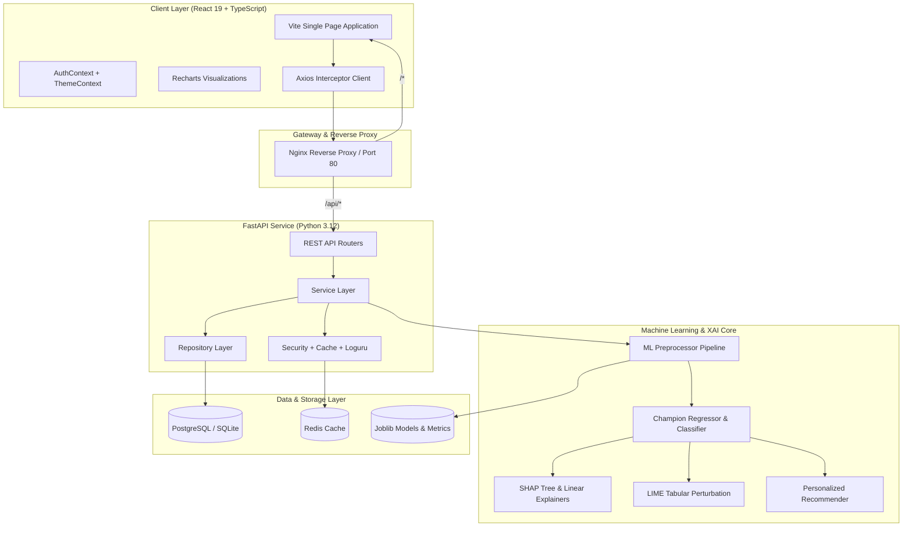

# System Architecture & Technical Design

The **Student Performance Prediction AI** platform is engineered using modern clean architecture principles, separating the user interface, API gateway, business domain, persistence layer, and Machine Learning / XAI subsystem into decoupled, scalable modules.

---

## 1. Backend Layered Architecture

The backend adopts strict separation of concerns across 7 distinct layers:

1. **`routers/` (Presentation & HTTP Transport)**:
   - Encapsulates endpoint definitions, dependency injection, and Pydantic request/response serialization.
   - Zero business logic inside routes.

2. **`services/` (Domain Business Logic)**:
   - Orchestrates multi-step workflows: single student scoring, vector batch CSV parsing, risk tier categorization, SHAP explanation extraction, and personalized recommendation generation.

3. **`repositories/` (Data Access Layer)**:
   - Encapsulates all SQLAlchemy queries and operations for Users, Predictions, Audit Logs, and Model Versions.

4. **`schemas/` (Pydantic V2 Contracts)**:
   - Strict runtime input validation, boundary constraints (e.g. $G1, G2 \in [0, 20]$, $failures \in [0, 4]$), and OpenAPI schema generation.

5. **`models/` (SQLAlchemy ORM Entities)**:
   - Relational database mappings for PostgreSQL and SQLite.

6. **`core/` (Cross-Cutting Concerns)**:
   - Configuration via Pydantic BaseSettings, JWT creation & verification (HS256), Loguru structured logging, global exception handling, and Redis/In-Memory caching.

7. **`ml/` (Machine Learning & Explainable AI)**:
   - Ingestion, custom feature engineering, ColumnTransformer pipelines, multi-model benchmarking, SHAP explainer wrappers, and artifact serialization.

---

## 2. Machine Learning Architecture

- **Problem Formulation**: Dual-task learning:
  1. *Regression*: Continuous grade estimation ($G3 \in [0, 20]$).
  2. *Classification*: Binary Pass/Fail prediction ($G3 \ge 10$) with probability estimation.
- **Algorithms Benchmarked**:
  - Linear Regression, Ridge, Lasso
  - Random Forest Regressor & Classifier
  - Gradient Boosting Regressor & Classifier
  - XGBoost & LightGBM
  - Decision Trees & Extra Trees
- **Champion Selection**: Automatic ranking by test set $R^2$, RMSE, and 5-fold cross-validation score.

---

## 3. Explainability Subsystem (XAI)

- **SHAP (SHapley Additive exPlanations)**: Calculates game-theoretic Shapley values quantifying the exact positive or negative contribution of each feature towards the forecast relative to the cohort mean.
- **LIME (Local Interpretable Model-agnostic Explanations)**: Generates locally faithful surrogate linear models to explain specific decision boundaries.
- **Natural Language Translation**: Automatically translates complex mathematical feature impacts into intuitive human insights.
